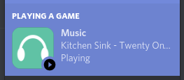

# Discord RPC - MPRIS



> A Discord Rich Presence client that connects to MPRIS music players

This is a super simple RPC client that connects to any MPRIS music player and shows your current song, as well as a nifty little image.

## Installation

This project requires Python to be installed, and is only functional on Unix operating systems due to the nature of MPRIS.

### User installation
```bash
pip install --user git+https://github.com/RayzrDev/discord-rpc-mpris@master
```

### Virtualenv installation
1. Create a virtual env
   ```bash
   python3 -m venv .env
   ```
2. Activate the venv
   ```bash
   . .env/bin/activate
   ```
3. Install it
   ```bash
   pip install git+https://github.com/RayzrDev/discord-rpc-mpris@master
   ```

## Usage

### With the user installation
Just run the `discord-rpc-mpris` command, I hope.

### Virtualenv installation
1. Activate the virtualenv `. path/to/virtual/env/bin/activate`
2. Run `discord-rpc-mpris`

The client will connect to your account.

## Join Me

[](https://discord.io/rayzrdevofficial)
